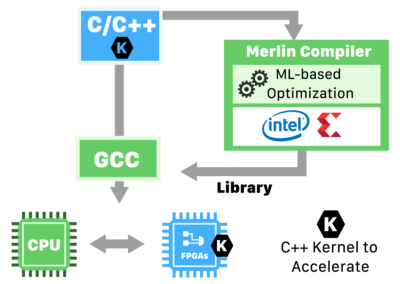
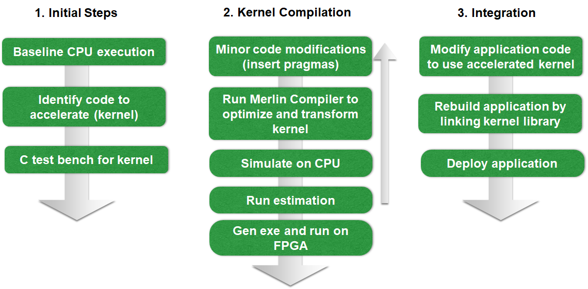

<table style="width:100%">
  <tr>
    <th width="100%" colspan="6"><h2>Merlin Compiler</h2></th>
  </tr>
  <tr>
    <td width="20%" align="center"><a href="README.md">1. Introduction</a></td>
    <td width="20%" align="center"><b>2. Developing for FPGAs</b></td> 
    <td width="20%" align="center"><a href="WORKING_W_MERLIN.md">3. Working with Merlin</a></td>
    <td width="20%" align="center"><a href="PLATFORM_SPECIFIC.md">4. Platform-Specific</a></td>
   </tr>
</table>

---------------------------------------
**2. Developing for FPGAs** 

**What is a FPGA** 
A Field-Programmable Gate Array (FPGA) is an integrated circuit (IC) that can be programmed/re-programmed in the field after manufacture. It contains blocks of resources: Logic Elements, Memory Blocks (RAM), Digital Signal Processor (DSP) and High Speed I/O (a.k.a. Transceiver). 

**Overview of an FPGA Acceleration System** 
A typical FPGA acceleration system consists of a host with a CPU that is running Linux OS, and a FPGA board that is plugged in a PCIe slot. The FPGA board has its own memory. For example, an Intel Arria 10 GX FPGA GX has 2 GB of DDR4 SDRAM, a Xilinx U200 board has 16 GB DDR4.

**Traditional FPGA Design Methodology** 
A typical FPGA hardware designer need to perform some or all of these tasks:
- Logic Design
- Implementation in Verilog/VHDL
- I/O assignments
- Design Partitioning
- Floor Planning
- Timing Closure
- Synthesis
- Simulation
- Verification

This makes it a complex and lengthy project that can run from weeks to months depending upon the application.

**The Merlin™ Alternative** 
Merlin by taking C/C++ code as an input, opens the door for non-FPGA engineers to take advantage of that computing technology. Merlin can be operated in 2 modes:

**Manual Optimization:** In this mode, a Merlin user would insert pragmas such as pipeline, parallel, tile etc. that would provide hints to the compiler on how to optimize their code. This mode is useful for developers who have understanding of the FPGA constructs & may have some experience with High Level Synthesis

**Deep Space Exploration (DSE):** DSE eliminates the need for the pragma insertion & only requires the developer to identify the code segments(called kernels)  that need to be accelerated. The optimization is completely handled by the compiler to get good performance. DSE is based on Falcon developed proprietary Machine learning algorithms. 

  

**Recommended Merlin Work-Flow** 
Initial step is to execute the code on CPU and identify the hotspots. A hotspot is an area of the application, that is causing a performance bottleneck. Hotspots are candidates for acceleration on FPGA using Merlin Compiler. 

  

To profile the application on the CPU, an open-source profilers such as valgrind and gprof can be leveraged. Also some commercial profiler such as Intel vTune™ are available. 

In the following sections, we will discuss the kernel compilation and integration phases in more details.
 
 
Start the next module: <a href="WORKING_W_MERLIN.md">3. Working with Merlin</a>
