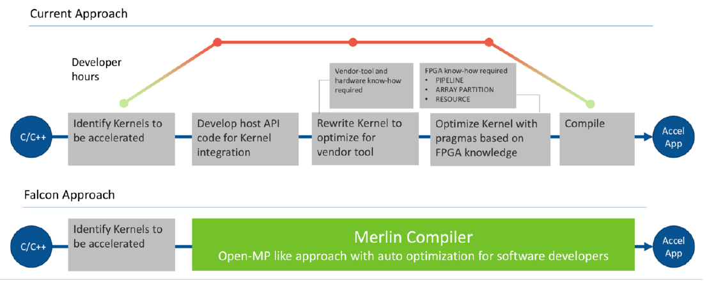

<table style="width:100%">
  <tr>
    <th width="100%" colspan="6"><h2>Merlin Compiler</h2></th>
  </tr>
  <tr>
    <td width="20%" align="center"><b>1. Introduction</b></td>
    <td width="20%" align="center"><a href="DEVELOPING_FOR_FPGA.md">2. Developing for FPGAs</a></td> 
    <td width="20%" align="center"><a href="WORKING_W_MERLIN.md">3. Working with Merlin</a></td>
    <td width="20%" align="center"><a href="PLATFORM_SPECIFIC.md">4. Platform-Specific</a></td>
   </tr>
</table>

---------------------------------------
### 1.Introduction
Some cogntive-era applications such as Genomics, Machine Learning inferencing and Big data analytics can be compute-heavy. Accelerating such applications can be achieved by offloading parts of the applications from a typical CPU to other types of hardware, such as FPGAs. For specific categories of applications, FPGAs can deliver much faster results than a typical CPU. This is due to the highly parallel nature inherited in FPGAs by architecture.

Traditionally, designing for FPGA is done using hardware descriptive languages such as Verilog or VHDL. Learning and using such languages can be quite involved, especially for a software developer.
The Merlin Compiler from Falcon Computing solves this challenges. It enables software developers to be able to compile their applications for FPGA acceleration without FPGA expertise. Merlin Compiler takes C/C++ code as an input and generates an executable that includes the CPU host-code & the FPGA bitstream . 

**Why Merlin?** 
By abstracting all the hardware design details away from the software developers, Merlin provides an easier alternative to leverage FPGAs hosted in public clouds (such as Amazon AWS F1 ) or within an on-premises environment. It is able to automatically generate performance comparable to FPGA Ninjas with Hardware expertise working for several weeks or months  using High Level Synthesis such as SDAccel or Intel OpenCl 

  

 

This is a tutorial on how to use Merlin Compiler on Amazon AWS as well as on-premises. In this tutorial, you will see a few design examples. The below table gives a brids’eye view of the benefits on Merlin in terms of # of pragmas & comparable performance:

<table>
  <tr>
     <th>Design Example</th>
     <th>HLS Source</th>
     <th>Merlin Source</th>
     <th>HLS # of pragmas</th>
     <th>Merlin # of pragmas</th>
  </tr>
  <tr>
     <td>Vector Add</td>
     <td> <a href="https://github.com/awslabs/aws-fpga-app-notes/blob/master/reInvent18_Developer_Workshop/helloworld_c/src/vadd.cpp">vadd.cpp</td>
     <td><a href="./Examples/vectoradd/src/vec_add_kernel.cpp">vec_add_kernel.cpp</a></td>
     <td>8</td>
     <td>2</td>
  </tr>
  <tr>
     <td>BlackScholes</td>
     <td>  
       <a href="https://github.com/KitAway/FinancialModels_AmazonF1/blob/master/blackScholes_model/asianOption/blackScholes.cpp ">blackAsian.cpp</a> 
       <a href="https://github.com/KitAway/FinancialModels_AmazonF1/blob/master/blackScholes_model/asianOption/blackScholes.cpp">blackScholes.cpp</a>
     </td>
     <td>
       <a href="./Examples/blackscholes_asianoptions/src/blackAsian.cpp">blackAsian.cpp</a> 
       <a href="./Examples/blackscholes_asianoptions/src/blackScholes.cpp">blackScholes.cpp</a>
     </td>
     <td>33</td>
     <td>5</td>
  </tr>
  <tr>
     <td>AES</td>
     <td>N/A</td>
     <td><a href="./Examples/aes/src/aes.cpp">aes.cpp</a></td>
     <td>N/A</td>
     <td>6</td>
  </tr>
</table>

Start the next module: <a href="DEVELOPING_FOR_FPGA.md">2. Developing for FPGAs</a>
